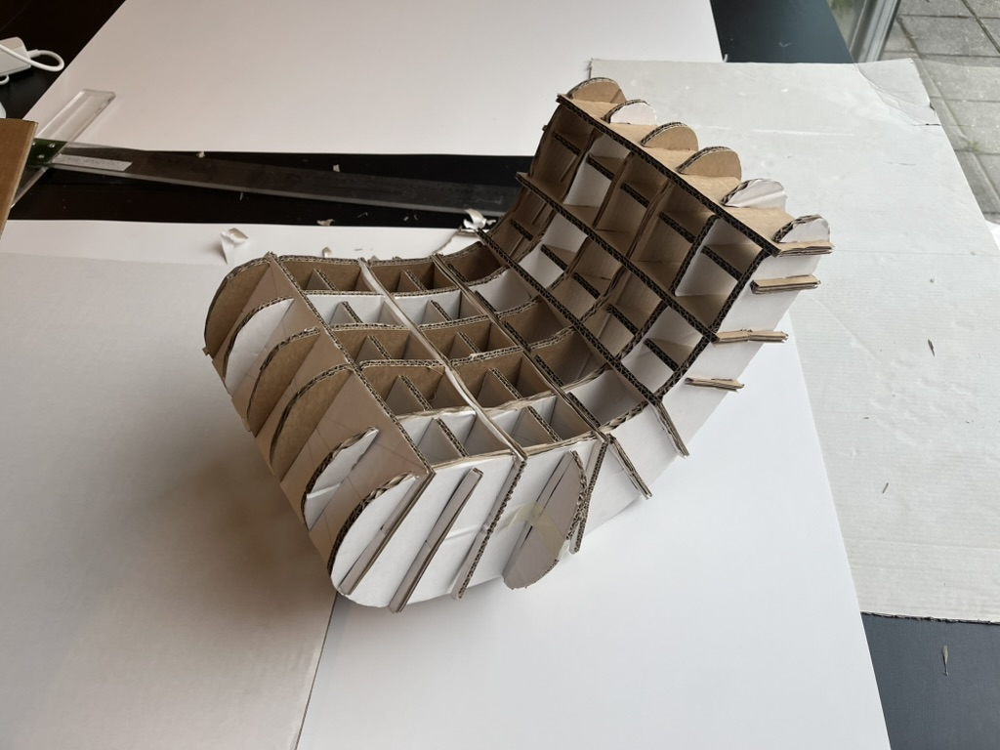
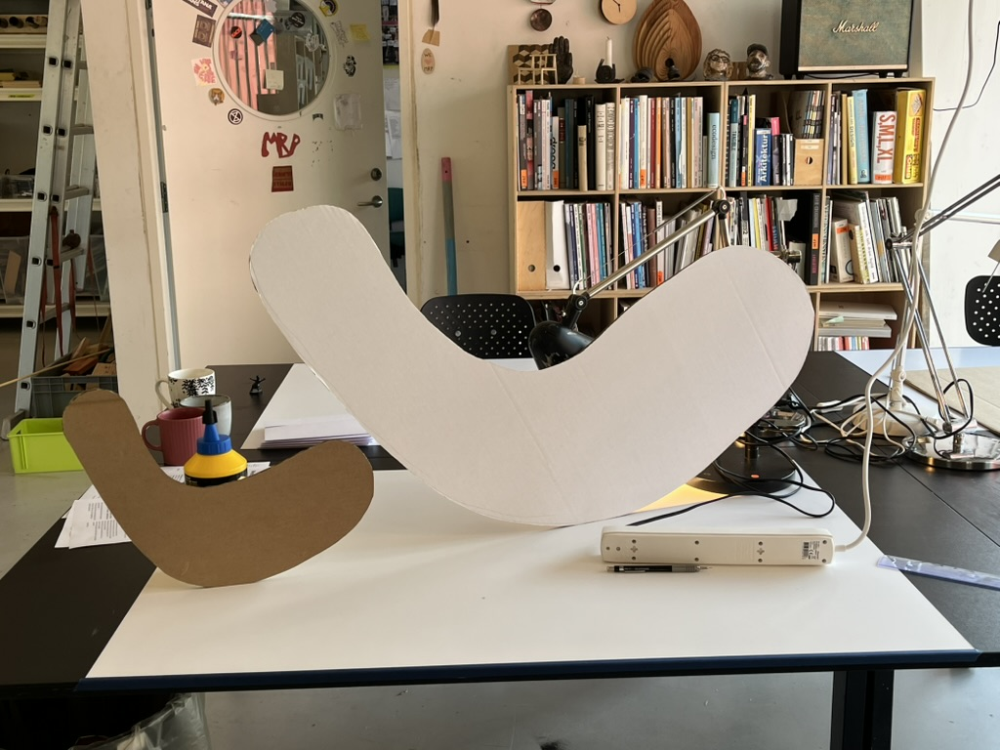
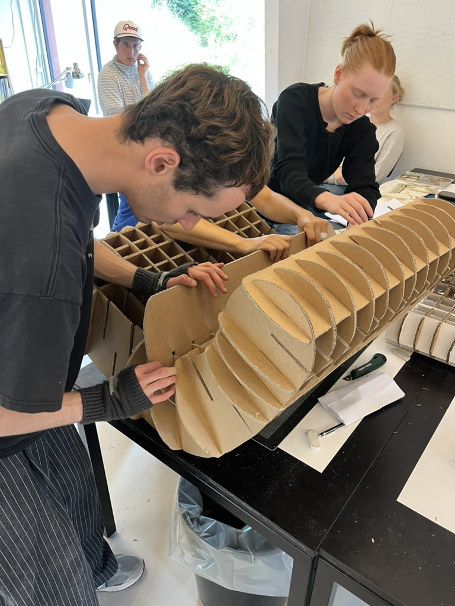
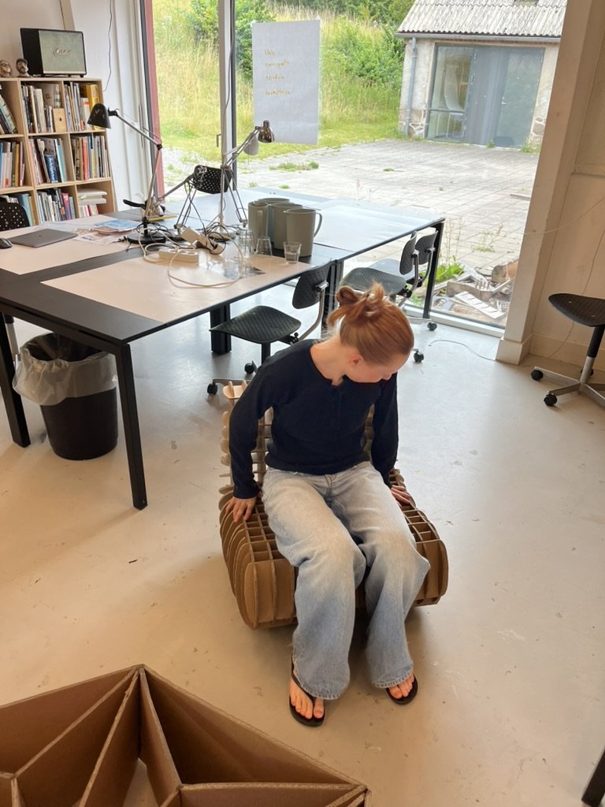



#### Prologue
This was the first project that I did at the Scandinavian Design College, but it turned out to be one of my favourite.  

We started out by making a small model of the chair, in order to test out the strength and visual look of the chair. The model was succesful, and you could even sit on it which we didn't expect.  

This design was done in collaboration with my friend Selma.

 

#### Procedure
It was made by gluing together 2 mm cardboard on top of eachother, in order to add strength. Later on it was cut into the wanted shapes in order, that were previously drawn up on paper as a template. The shapes were put togehter in a rectangular slats pattern. 


  
  
  


#### Epilogue
I started out by having the chair in my room, but it suddenly dissappeared. I accused Selma of stealing it. It wasn't until the final week, where i learned that my roommate Rasmus and Selma had collaborated in stealing the chair. The chair is now in my parents apartment.