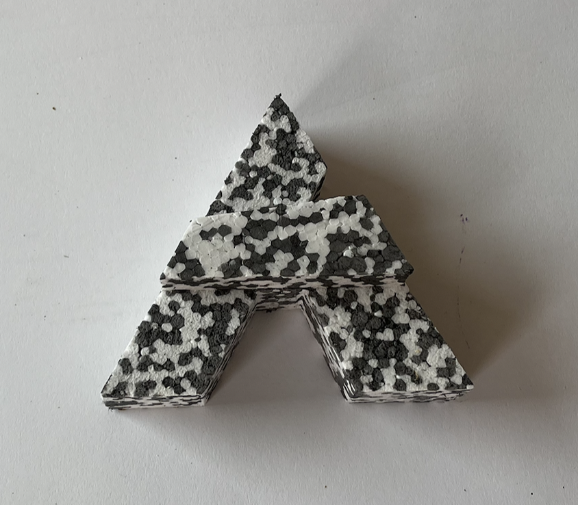



## Motivation
The task was to create a set of reliable and robust benches that would not only last this summers GRIM festival, but also last many years to come. I was attending the Scandinavian Design College, and they had invited some Czech high school students to collaborate with us on this task. Together with my Czech friend, we creted the V, while other groups created the rest of the letters spelling out DIVERSITET:)

 

## Work
The project started with a sketching phase, that ended with a 1:100 scale model of the final design.
 
This model was remade in 1:50 scale, with MDF-sticks in order to understand the size and complexity of our design. We quickly understood that our design had some complex angles.

## Reflection
The work started out with an intensive week in late summer where we did the majority of the work, but our teacher had severely underestimated the time, that the project would consume. It became an ongoing joke that the Rene always wanted us to work on it during our free-time and weekends. It will nevertheless be a time that i will look fondly back on. More pictures are available on https://www.flickr.com/photos/temboark/albums/72177720329196212/
