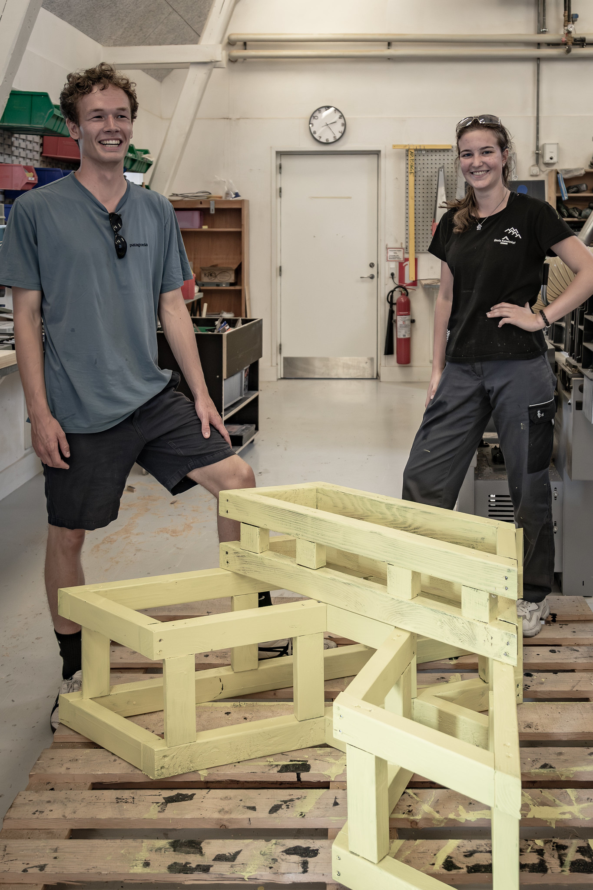



## Motivation
Die Aufgabe bestand darin, eine Reihe zuverlässiger und robuster Bänke zu schaffen, die nicht nur das diesjährige GRIM Festival überdauern, sondern auch viele kommende Jahre halten würden. Ich besuchte das Scandinavian Design College, und sie hatten einige tschechische Gymnasiasten eingeladen, mit uns an dieser Aufgabe zusammenzuarbeiten. Zusammen mit meinem tschechischen Freund gestalteten wir das V, während andere Gruppen die restlichen Buchstaben für das Wort DIVERSITET:) erstellten.

 

## Reflexion
Die Arbeit begann mit einer intensiven Woche im Spätsommer, in der wir den größten Teil der Arbeit erledigten, aber unser Lehrer hatte die Zeit, die das Projekt in Anspruch nehmen würde, stark unterschätzt. Es wurde zum Running Gag, dass Rene immer wollte, dass wir in unserer Freizeit und an den Wochenenden daran arbeiten. Dennoch wird es eine Zeit sein, an die ich gerne zurückdenken werde.

Weitere Bilder sind verfügbar unter https://www.flickr.com/photos/temboark/albums/72177720329196212/