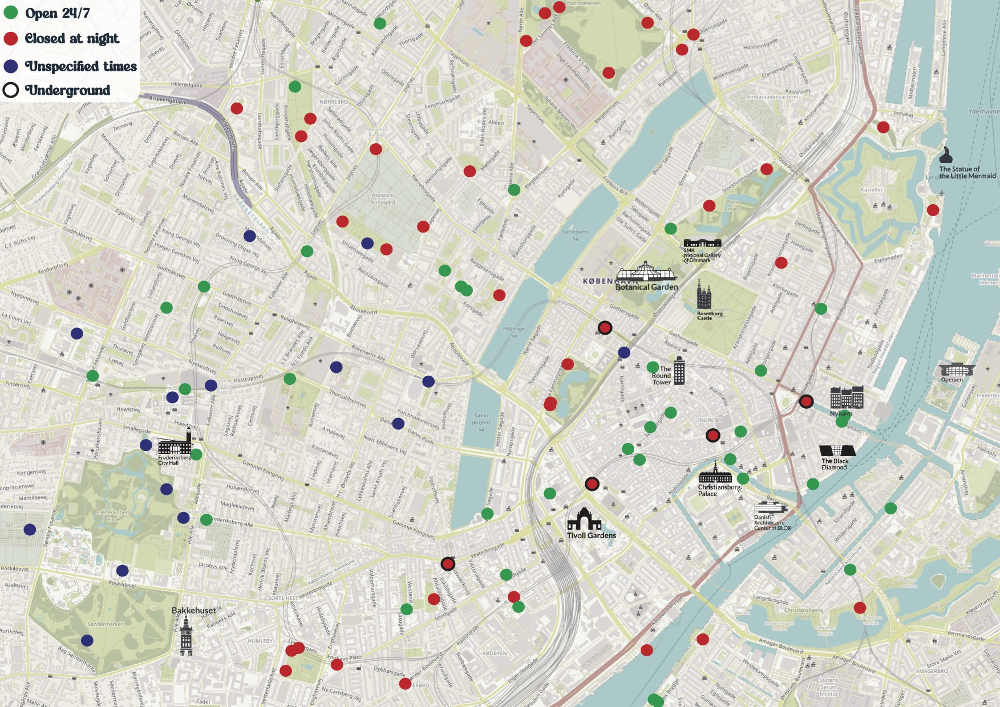
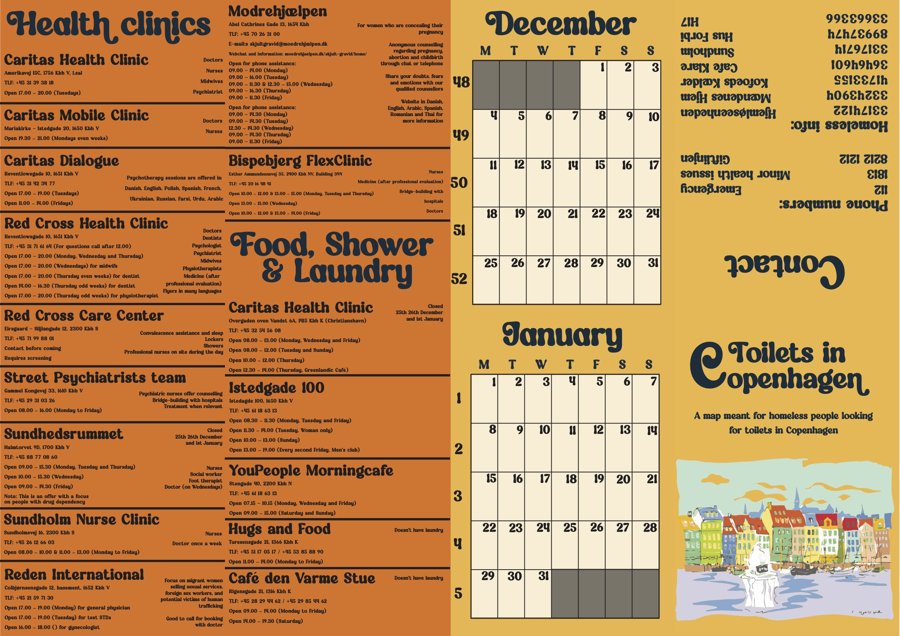

Obdachlose Frauen haben oft Schwierigkeiten, eine Toilette zu finden. Wir haben eine Karte erstellt, die alle Toiletten in Kopenhagen verzeichnet und wichtige Informationen für obdachlose Menschen enthält.

Die beiden Seiten der Karte sind unten zu sehen.

 

 

Das Projekt entstand im ersten Kurs, den ich an der Universität zum Thema benutzerzentriertes Design belegt habe.