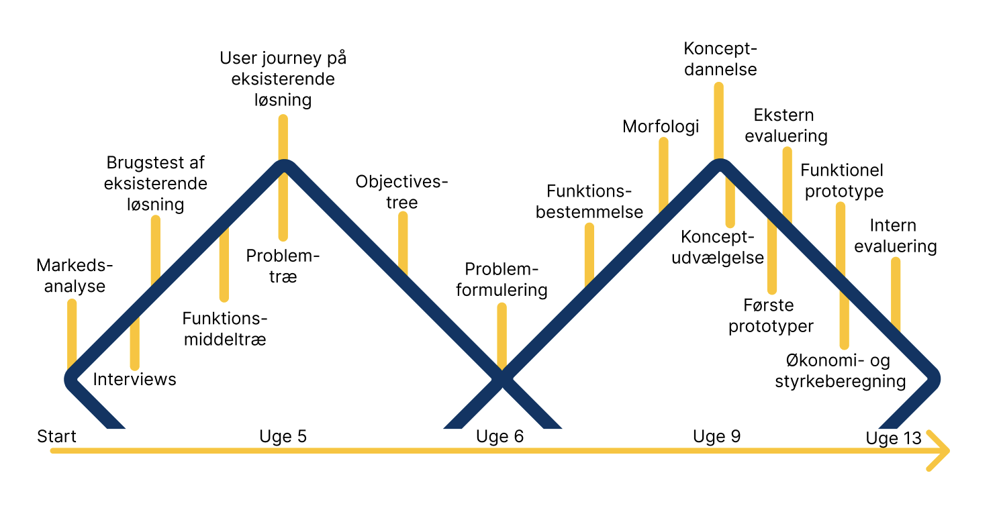
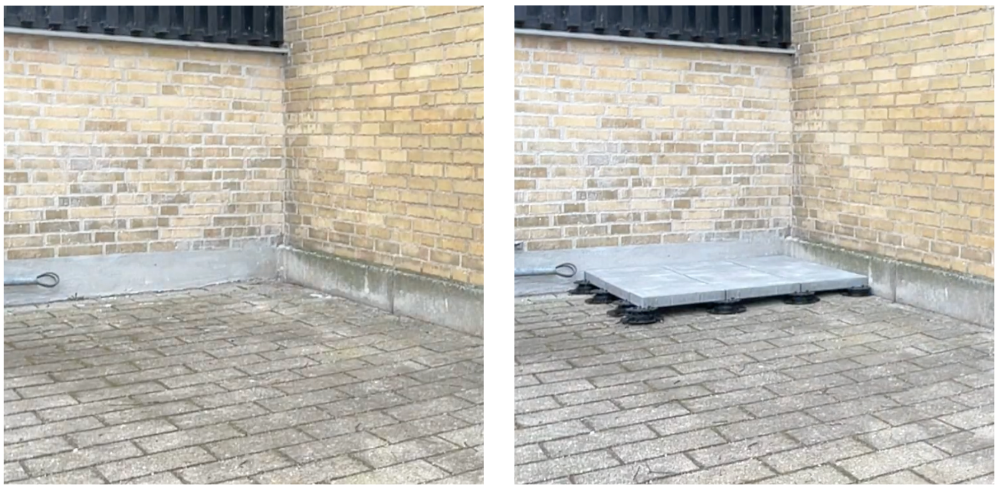
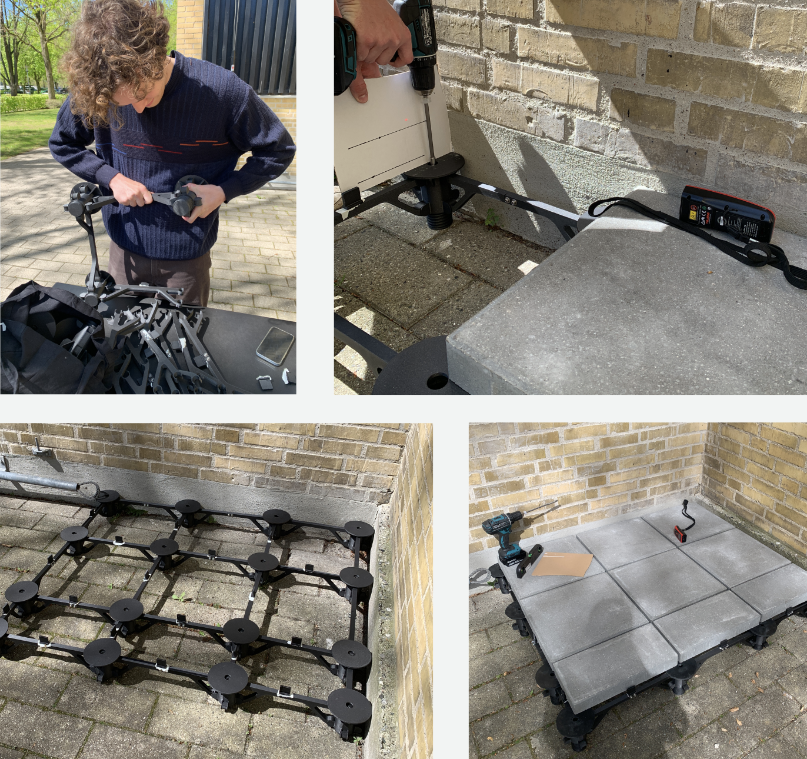

**Bachelorprojekt (20 ECTS) · DTU Construct · Februar-maj 2026**
**Sammen med:** Andreas Melvang · **Vejleder:** Niels Henrik Mortensen · **Samarbejdspartner:** Artlinco A/S

Terrassefødder gør det muligt at lægge en hævet fliseterrasse uden at støbe et betonfundament - intet gravearbejde, ingen dræningsudfordringer og nem adgang til det, der ligger under terrassen. Problemet er finjusteringen: at nivellere titallige enkelte fødder i hånden, én flise ad gangen, er langsomt og fejlbehæftet. Dette projekt satte sig for at redesigne selve terrassefoden for at løse det.

### Proces
- **Konkurrentanalyse** af de terrassefødder, der sælges i Danmark
- **Brugerundersøgelse** - 74% af private brugere prioriterer nem installation højere end pris og udseende
- **Produkttest** - en lille terrasse blev lagt med en eksisterende terrassefod (Eurotec Pro) for at tage tid og kortlægge udfordringer
- **Konceptudvikling** - flere retninger blev undersøgt, før de konvergerede til ét sammenhængende gitterkoncept
- **Til-skala validering** - en 3D-printet 1,2 × 1 m prototype, bygget og skruet sammen udendørs for at teste og forbedre designet

 

### Vigtigste fund
- Finjusteringen alene stod for størstedelen af de ca. 53 minutter, det tog at lægge referenceterrassen
- Referenceproduktets plastik-fugetapper knækkede gentagne gange under fliserenes vægt
- Justering af én fod fik let naboerne til at rykke sig

 

### Løsningen
Et præmonteret gitter af fødder og bjælker, der klikkes sammen med simple clips, før en eneste flise placeres, så hele fundamentet stabiliseres som én konstruktion i stedet for adskillige uafhængige punkter.
- Bjælkerne kan justeres i længden, så de passer til alle flisestørrelser
- Afslutningselementer, der klikkes på, giver den synlige kant et ordentligt finish
- En monteringsstang gør det muligt at spænde en lasermodtager direkte på gitteret, så alle fødder måles op mod samme referencehøjde

 

### Resultat
- **27% hurtigere installation** end referenceproduktet (38,5 mod 53 minutter)
- En gummibelægning stoppede fliserne i at skride på fødderne

Stadig et koncept frem for et markedsklart produkt - eksterne brugertests, optimering til sprøjtestøbning og en løsning til træterrasser er de oplagte næste skridt.

Den endelige rapport for projektet kan findes nedenfor.


