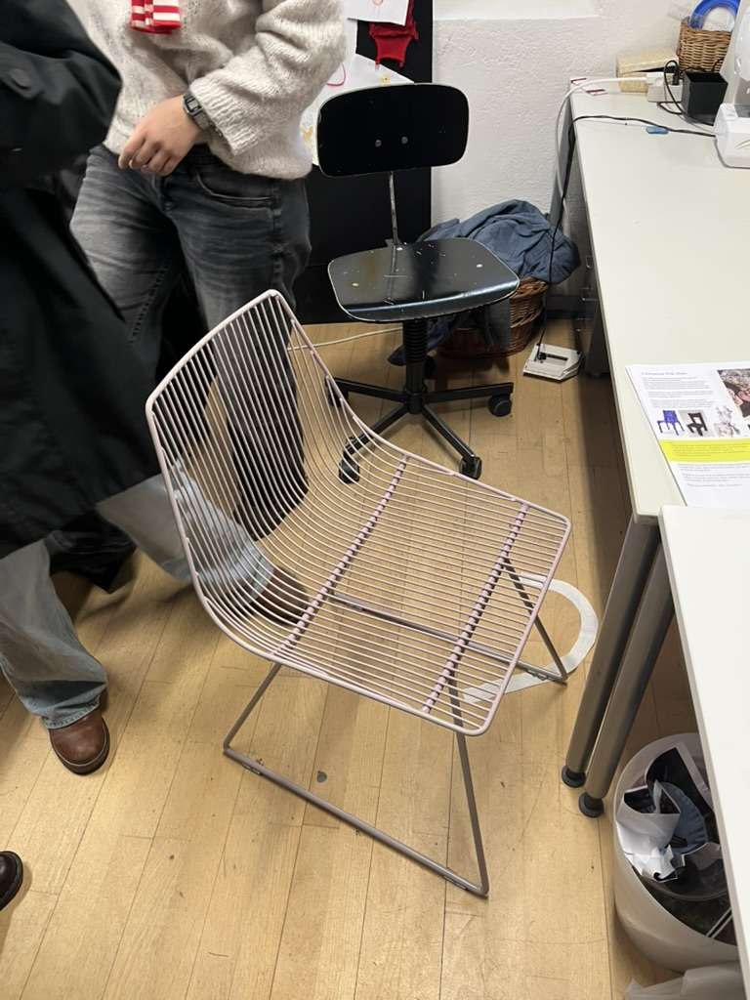
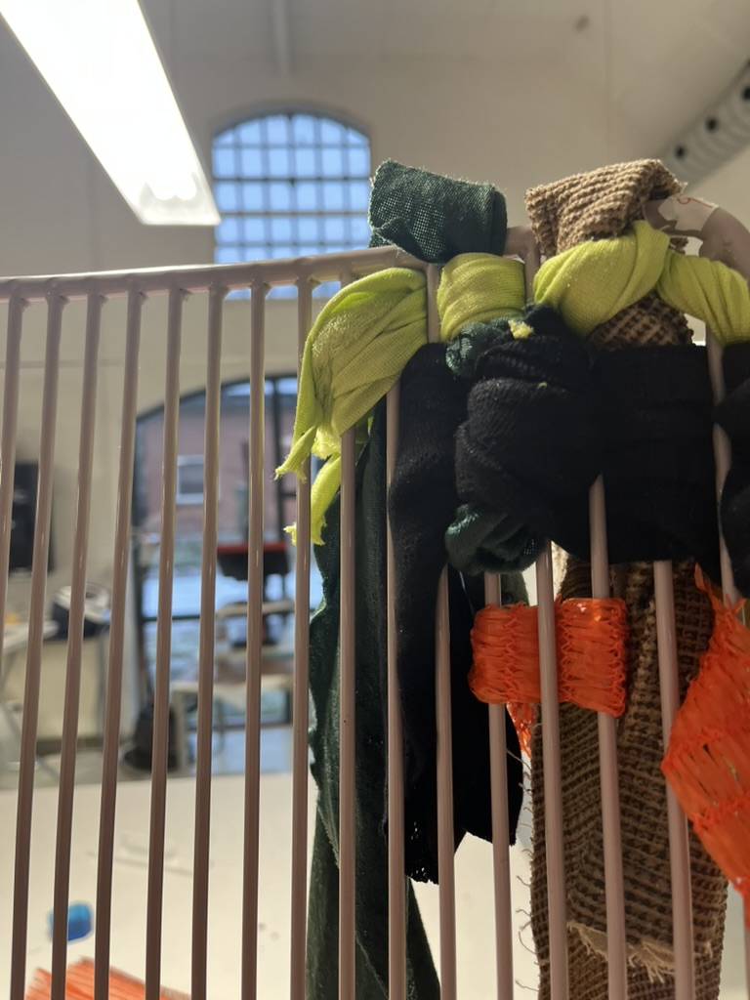



Dieses Projekt wurde am Dänischen Designkolleg in einer Zusammenarbeit zwischen Produktdesign und Textildesign abgeschlossen. Ich wurde zusammen mit meiner Freundin Amalie beauftragt, den folgenden Stuhl zu verwenden, um einen neuen und aufregenderen Stuhl zu schaffen, der von der Arbeit von Kenneth Rasmussen inspiriert ist.

 

Wir haben zwei Tage lang über Kenneth Rasmussen recherchiert und wie wir seinen Stil in unser Design einbringen können. Wir entschieden uns, seinem ikonischen Flechtstil zu folgen und alte Stoffe und Kunststoffe wiederzuverwenden, um sie zwischen die Metall-"Stäbe" zu flechten.

 
